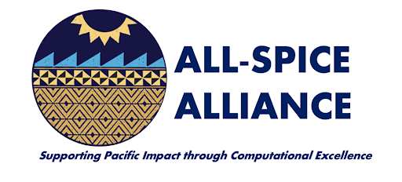

# AFRL, 2022-23 School Year

  

## Background of the Partnership 

The Airforce Research Laboratory (AFRL) extended a research partnership to ROTC, active duty, reserve military, or US armed forces, veteran students, at Chaminade University of Honolulu and The University of Hawaii at Manoa in Big Data and Analytics. This research partnership allowed students to explore the domain of Data Science and Analytics while exploring nanomaterials with little to no background. This project was built into two phases. Phase I, consisted of training each student in Data Science programming skills, mathmatical and computational skills. Phase II consisted of a research project on Nanomaterials guided by domain experts and mentors.  This repository reflects the research project that was completed by Chaminade Data Analyst [Connor Flynn](https://github.com/ConnorFlynn), Chaminade Undergraduate Researchers [Brittany Johnson](https://github.com/Brittanysas) (Nursing Major) and [Armando Luna](https://github.com/the-lunaverse) (Data Science Major) in Phase II. 

## Purpose of the Project

Nanomaterials are materials that are made up of particles that are nanometers in size. This project enabled our researchers to collect, analyze, and interpret data related to the properties of nanomaterials. These properties included physical characteristics such as size, shape, and composition, as well as chemical and electrical properties. 

Data was sourced from the sumplemental material of the article, ["Application of Bayesian networks in determining nanoparticle-induced cellular outcomes using transcriptomics"](https://www.tandfonline.com/doi/full/10.1080/17435390.2019.1595206). The data collected was used to create models of the materials and their properties. The results of this project can help improve our understanding of nanomaterials and their potential applications. Additionally, these models aided in predicting the behavior of nanomaterials in different contexts.
